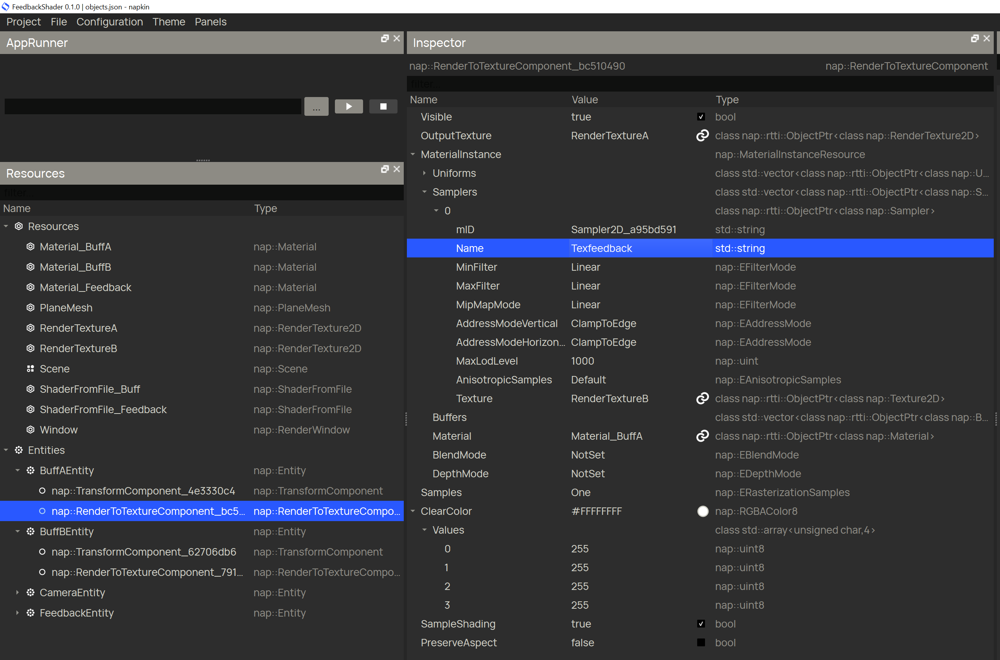

# Nap-FeedbackShader

 

[shader feedback](https://www.shadertoy.com/view/3dsBRl) in [Nap Framework](https://www.napframework.com/)

 
 

 
 

# Getting Started

 

1) Download [Nap Framework](https://www.napframework.com/) from [here](https://github.com/napframework/nap/releases) (>= 0.5.0).

 

2) Check your build environnement is ready for use:

 

Inside your `[NapInstall]/tools`, execute the `check_build_environment` script.

 

3) Copy the feedbackshader [folder](./feedbackshader/) inside your `[NapInstall]/projects` folder.

 

4) Execute the `regenerate` script from inside the feedbackshader folder.

 

If you are not on windows, make sure to re import the relevant `regenerate` script from your `NapInstall` .

 

5) Open in your IDE, and run it.

 

# [Napkin](https://github.com/napframework/nap/tree/main/tools/napkin)

 

The elements of the scene are created using Napkin.

 

This way the Feedback shader is made by using the 2 buffer drawing into each others, and a render buffer for the screen:

 

 

Each bufferEntity (`BuffAEntity` & `BuffAEntity`) has a [RenderTexture2D](https://docs.nap.tech/d6/d5e/classnap_1_1_render_texture2_d.html) associated which renders its result offline:

 

Each bufferEntity has a Material with a shader which takes the other RenderTexture2D as sampler2D uniform:

 

* `Material_BuffA` has the uniform `Texfeedback` which is the `RenderTexture2D` `RenderTextureB`,
* `Material_BuffB` has the uniform `Texfeedback` which is the `RenderTexture2D` `RenderTextureA`,  

 

Each frame, one RenderTexture2D is rendered, alterning every frame between the RenderTexture2D corresponding to `BuffAEntity` or `BuffBEntity`. 

 

Then the index corresponding to the RenderTexture2D is passed to the rendering shader, switchiung between rendering `BuffAEntity` or `BuffBEntity` results into the  `mFeedbackEntity` [RenderableMeshComponentInstance](https://docs.nap.tech/d9/d73/classnap_1_1_renderable_mesh_component_instance.html).
